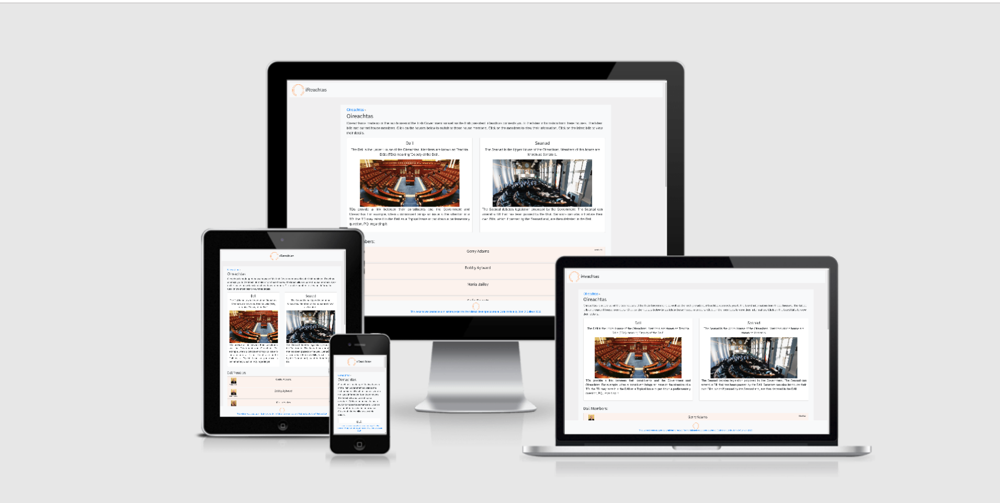

# Oireachtas Viewer

A data repository for displaying data gathered from oireachtas API.
Displayed data will include latest bill proposed in Irelands Government houses: Dail and Seanad.
Charts will also show debate topics, members involved, vote results and more.
The site will provide condensed descriptions of the elements of the oireachtas.

Hosted on [GitHub Pages](https://pattern-projects.github.io/oireachtas-ifd-project/index.html)
Repository on [GitHub](https://github.com/Pattern-Projects/oireachtas-ifd-project)

## License
The project is shared for use with the [GNU General Public License v3](LICENCE)

>   This program is free software: you can redistribute it and/or modify
    it under the terms of the GNU General Public License as published by
    the Free Software Foundation, either version 3 of the License, or
    (at your option) any later version.

## UX



Use this section to provide insight into your UX process, focusing on who this website is for, what it is that they want to achieve and how your project is the best way to help them achieve these things.

In particular, as part of this section we recommend that you provide a list of User Stories, with the following general structure:
- As a user type, I want to perform an action, so that I can achieve a goal.

This section is also where you would share links to any wireframes, mockups, diagrams etc. that you created as part of the design process. These files should themselves either be included in the project itself (in an separate directory), or just hosted elsewhere online and can be in any format that is viewable inside the browser.

### Users 
Expected users of the website include lawmakers, educators, journalists and students of all kinds. 
They come to the website with questions in need of answering.

### User Stories
1. A student user wants to learn more about the houses of the oireachtas
2. An education professional user wants to share learning resources with their students
3. A journalist user looking up the latest legislation
4. Oireachtas member user searching for colleague information
5. A political scientist looking for the party of a certain house member

### Design


- Colour scheme consists of complementary colours 
    - Tweaked versions of archaic [government flag](https://upload.wikimedia.org/wikipedia/commons/thumb/c/cb/Arms_of_Ireland_%28historical%29.svg/220px-Arms_of_Ireland_%28historical%29.svg.png) colours.
    - irish-gold:    `#FFA65D`
    - patrick's-blue:      `#D2E2FF`
- [Custom designed logo](documentation/logo.png) resembling [five rows of dail](documentation/rows-dail.jpg) and [four rows of seanad](documentation/rows-seanad.png) seats.
- roboto font used throughout the website
    - font-family: 'Roboto', 'helvetica' sans-serif;

### Mockups
The web app is a single page with different displays given for different functions:
- [Oireachtas](https://www.figma.com/file/TRccvoxe7EcOrHPFaSKdkixu/oireachtas-ifd-project?node-id=9%3A35)  
- [Member](https://www.figma.com/file/TRccvoxe7EcOrHPFaSKdkixu/oireachtas-ifd-project?node-id=5%3A3)  
- [Bill](https://www.figma.com/file/TRccvoxe7EcOrHPFaSKdkixu/oireachtas-ifd-project?node-id=8%3A29)  

## Features

Features planned, implemented and outlined for later development 

### Planned Features
- Documentation - ReadMe File, Licence & Mockups
- JavaScript focused development
- Data retrieval from [Oireachtas API](https://data.oireachtas.ie/)
- Page refreshes
- Dynamic content switching by house
    - Bills
    - Members
- Pagination
- Breadcrumbs
- D3/DC data charts
- Colour Scheme
- Custom Logo
- Favicon
- Jasmine Testing
- Bootstrap - HTML, CSS Framework
    - Grid System - Columns and Rows
    - Cards
    - Icons
- Responsive design - Mobile First
- UX elements
    - User Flow
    - Animations
    - Transitions
- Accesibility
- Git - Version Control System
- GitHub - Remote Repository
- Deployed - Hosted on Github Pages

### Existing Features
- Documentation - ReadMe File, Licence & Mockups
- JavaScript focused development
- Data retrieval from [Oireachtas API](https://data.oireachtas.ie/)
- Page refreshes
- Dynamic content switching by house
    - Members
- Pagination
- Breadcrumbs
- Colour Scheme
- Custom Logo
- Favicon
- Jasmine Testing
- Bootstrap - HTML, CSS Framework
    - Grid System - Columns and Rows
    - Cards
    - Icons
- Responsive design - Mobile First
- UX elements
    - User Flow
    - Animations
    - Transitions
- Accesibility
- Git - Version Control System
- GitHub - Remote Repository
- Deployed - Hosted on Github Pages


### Features Left to Implement
- D3/DC data charts
- Dynamic content switching by house
    - Bills
- Show members by constituency
    - GPS location

## Technologies Used

This project makes use of:
- [HTML](https://developer.mozilla.org/en-US/docs/Web/HTML)
    - HTML for strucutre
- [CSS](https://developer.mozilla.org/en-US/docs/Web/CSS)
    - CSS for Styling
- [JavaScript](https://www.w3schools.com/jsref/)
    - **JavaScript** for application controller
- [JQuery](https://jquery.com)
    - The project uses **JQuery** to simplify DOM manipulation.
- [Google Chrome](https://www.google.com/chrome/)
    - Used for browser and dev tools
- [Mozilla Firefox](https://www.mozilla.org/en-US/firefox/new)
    - Used for browser and dev tools
- [Google](https://www.google.com/)
    - **Google** was used for research.
- [Bootstrap](https://getbootstrap.com/)
    - HTML and CSS Framework from **Bootstrap**
- [Visual Studio Code](https://code.visualstudio.com/)
    - This project was built using the **VS Code** IDE
- [Git](https://git-scm.com/)
    - **Git** used for Version Control
- [GitHub](https://github.com/)
    - Repository hosted on **GitHub**
- [Github Pages](https://pattern-projects.github.io/oireachtas-ifd-project/)
    - Website hosted on **Github Pages**
- [Oireachtas API](https://api.oireachtas.ie/)
    - Data collected from the **Oireachtas API**
- [DC](https://dc-js.github.io/dc.js/)
    - Data charts created with **DC**
- [Jasmine](https://cdnjs.com/libraries/jasmine)
    - Development testing completed with **Jasmine**
- [Am I Responsive](http://ami.responsivedesign.is)
    - Testing responsiveness of the website

## Testing

<!-- In this section, you need to convince the assessor that you have conducted enough testing to legitimately believe that the site works well. Essentially, in this part you will want to go over all of your user stories from the UX section and ensure that they all work as intended, with the project providing an easy and straightforward way for the users to achieve their goals.

Whenever it is feasible, prefer to automate your tests, and if you've done so, provide a brief explanation of your approach, link to the test file(s) and explain how to run them.

For any scenarios that have not been automated, test the user stories manually and provide as much detail as is relevant. A particularly useful form for describing your testing process is via scenarios, such as:

1. Contact form:
    1. Go to the "Contact Us" page
    2. Try to submit the empty form and verify that an error message about the required fields appears
    3. Try to submit the form with an invalid email address and verify that a relevant error message appears
    4. Try to submit the form with all inputs valid and verify that a success message appears.

In addition, you should mention in this section how your project looks and works on different browsers and screen sizes.

You should also mention in this section any interesting bugs or problems you discovered during your testing, even if you haven't addressed them yet.

If this section grows too long, you may want to split it off into a separate file and link to it from here. -->

The site was tested through a number of means.

### Jasmine Test First Development

Jasmine was used for test first development where tests are written first then the fuctionality is written to pass the tests.
Steps to test with Jasmine are as follows: 

1. Open testing.html in the root directory
2. Run using a live server process
3. Visit the page with localhost:[port]/testing.html

Alternatively:

1. Visit the hosted version of the [website](https://pattern-projects.github.io/oireachtas-ifd-project/)
2. In the url add [testing.html/](https://pattern-projects.github.io/oireachtas-ifd-project/testing.html) to the end
3. The opened page will show the result of the assigned tests 

Tests were written first. Development met with hurdles that had to be worked around, making TFD infeasible in this case.

### User Stories

1. A student user wants to learn more about the houses of the oireachtas
    - From the Oireachtas page the user learns of the houses and members of the Oireachtas
2. An education professional user wants to share learning resources with their students
    - On the Oireachtas page the user clicks on a bill
    - On the bill page in the related documents section the user clicks on a document
    - The opened pdf is sharable with students
3. A journalist user looking up the latest legislation
    - On the Oireachtas page the user finds all the latest legislation
4. Oireachtas member user searching for colleague information
    - The user finds the name of the member they are searching for
    - They click on the user
    - In the opened page the user finds the required information of their colleagues
5. A political scientist user looking for party breakdown of oireachtas houses
    - The user finds the member from the Oireachtas page and click on them
    - In the member information the user finds party membership information


## Deployment

The project is hosted on [GitHub Pages](https://pattern-projects.github.io/oireachtas-ifd-project/)

The process involved:
- Host a git repository on GitHub. Explained [here](https://help.github.com/en/articles/create-a-repo).
- root folder contains README.md and index.html files
- On GitHub repository settings page move to GitHub Pages section
- Change source to master branch. (Or any desired branch)
- Provided link will be your projects home (index) page.
 
To deploy your own version of the website:
- Have git installed
- Visit the [repository]([GitHub](https://github.com/Pattern-Projects/oireachtas-ifd-project))
- Click 'Clone or download' and copy the code for http
- Open your chosen IDE (Cloud9, VS Code)
- Open a terminal in your root directory
- Type 'git clone ' followed by the code taken from github repository
    - ```git clone https://github.com/Pattern-Projects/oireachtas-ifd-project.git```
- When this completes you have your own version of the website
    - Feel free to make any changes to it
- The website can be run by opening one of the HTML files within a web browser
- Visit the link provided
- Your website with any made changes will appear
- Saved changes to the website will appear here after refreshing the page

The benefits of hosting your website on GitHub pages is that any pushed changes to your project will automatically update the website. Development branches can be created and merged to the master when complete.

It may take a moment for changes to appear on the hosted website.

During development the site is hosted using cloud9's local server feature. It runs in the browser.


## Credits

### Content
The text on the website has been copied from:  
- [Oireachtas](https://www.oireachtas.ie/)

### Media
The images for the website are taken from:
- [The Irish Times](https://www.irishtimes.com/)
- [Oireachtas](https://www.oireachtas.ie/)

<!-- The images for the documentation are taken from: -->


### Acknowledgements

Thank you to the following for inspiration, motivation and the direction I needed:

- [Matthew James Taylor](https://matthewjamestaylor.com/)
- Seun Owonikoko    @seun_mentor
- Simen Daehlin     @Eventyret_mentor
- Robin Zigmond     @robinz_alumni
-                   @Aymeric MC
- Edel O' Sullivan  @Edel O'Sullivan 
- John Lynch        @John_Lynch_alumnus
- Code Institute
